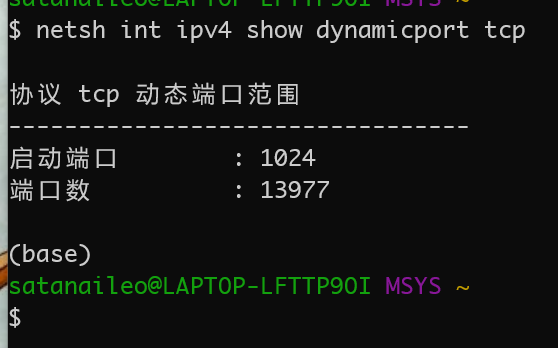
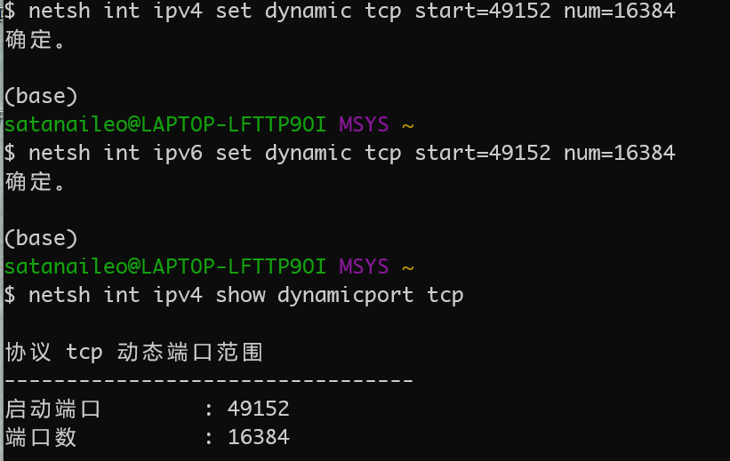

- 问题描述：启动Spring Boot项目时，默认端口8080提示端口被占用，修改为其他端口仍然提示端口被占用，但netstat -ano并没有看到相应端口被占用
  1. 查明是Hyper-V为容器宿主网络服务随机保留了一些端口号使用，关闭Hyper-V后恢复正常
  
  2. 
  
     如图所示，Hyper-V会在TCP动态端口范围内随机挑选一些端口号保留（占用），而8080，8888等端口都在目前的动态端口范围内
  
  3.  重新设置TCP动态端口范围即可在不关闭Hyper-V功能的情况下解决该问题(需要管理员打开终端)
  
     
  
  