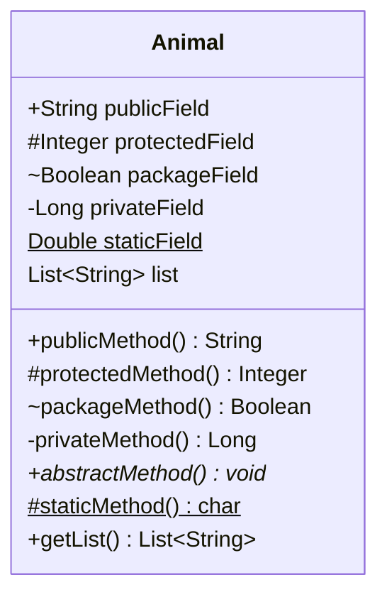
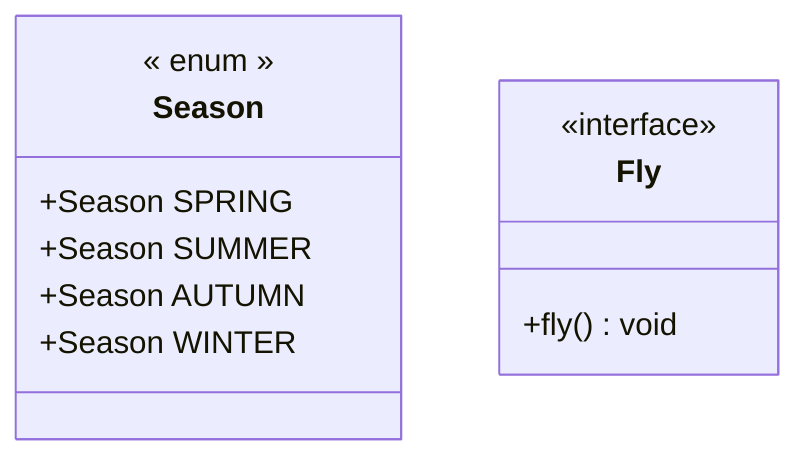
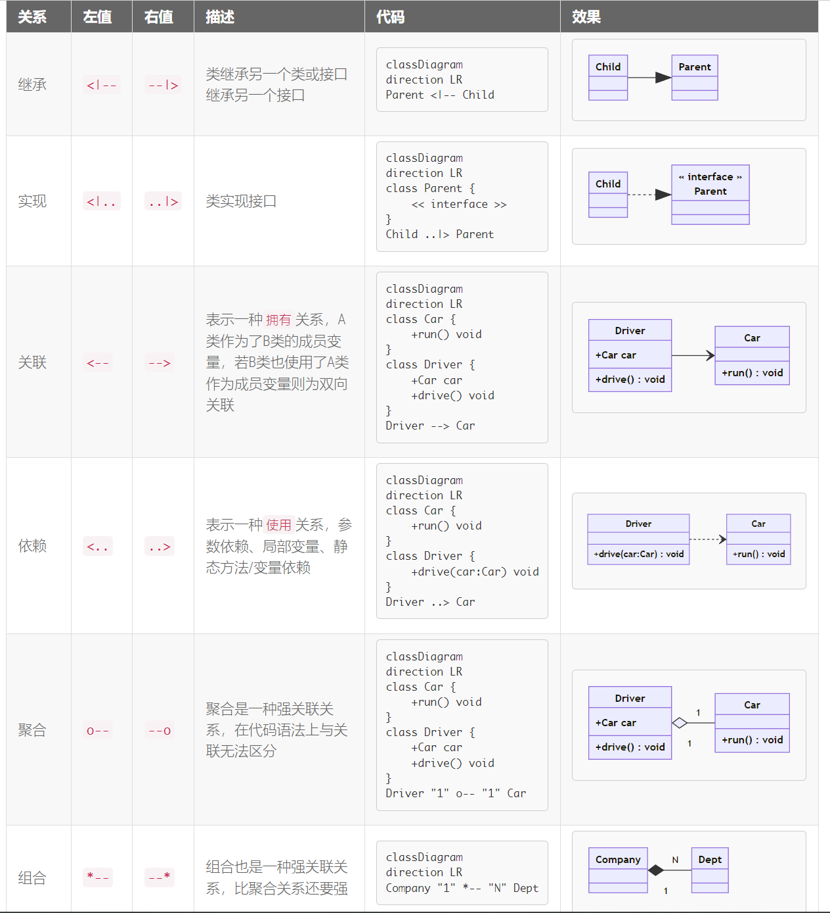

### 类图

类图(Class diagram)由许多(静态)说明性的模型元素(例如类、包和它们之间的关系，这些元素和他们的内容互相连接组成)。

类图可以组织在（并且属于）包中，仅显示特定包中的相关内容。类图(Class diagram)是最常用的UML图， 显示出类、接口以及它们之间的静态结构和关系；它用于描述系统的结构化设计。类图(Class diagram)最基本的元素是类或者接口。

[mermaid classDiagram](https://mermaid-js.github.io/mermaid/#/classDiagram)

mermaid关键字`classDiagram`(```mermaid)

| 符号 | 作用域                                         | 含义             |
| ---- | ---------------------------------------------- | ---------------- |
| +    | 方法、字段                                     | public           |
| -    | 方法、字段                                     | private          |
| #    | 方法、字段                                     | protected        |
| ~    | 方法、字段                                     | package/friendly |
| *    | 方法                                           | abstract         |
| ~~   | l类型（字段类型、返回类型、class/interface等） | 泛型             |




### 类注释

用于标记一个类的元素据，以`<<`开始，以`>>`结束，如`<<interface>>`， 在html中，需要开关前后有一个空格即`<< interface >>`。一个类型只会对第一个类注释生效。

常用标记有，`<<interface>>`、`<<abstract>>`、`<<enum>>`，分表代码接口、抽象类、枚举。 



### 方向

语法direction TB/BT/RL/LR默认TB


### 关系基数

关系基数主要用于`聚合`与`组合`，表名类与类之间的关联关系。语法如下 `[classA] "cardinality1" [Arrow] "cardinality2" [ClassB]:LabelText`

| 基数 | 含义           |
| ---- | -------------- |
| 1    | 有且只有1个    |
| 0..1 | 0个或1个       |
| 1..* | 1个或多个      |
| *    | 多个           |
| n    | n个, n大于1    |
| 0..n | 0至n个，n大于1 |
| 1..n | 1至n个，n大于1 |

### 类关系



### 链接

点击类跳转链接


### 综合示例

````mermaid
classDiagram
direction BT
%% 代谢基础水和氧气
class Water
class Oxygen
%% 生命接口
class Life {
    <<interface>>
    +metabolize(water:Water, oxygen:Oxygen)* void
}
Life ..> Water
Life ..> Oxygen
%% 动物
class Animal {
    <<abstract>>
    +String name
    +int age
    +String sex
    
    +breed()* void
}
%% 实现生命接口
Animal ..|> Life

%% 哺乳动物继承动物
class Mammal {
    +breed()* List~Mammal~
}
Mammal --|> Animal

class Dog {
    +Dog mate
    +breed()* List~Dog~
}
Dog --|> Mammal
Dog --> Dog

%% 鸟类继承动物，并且鸟有一双翅膀
class Wing
class Bird {
    +Wing left
    +Wing right
    +fly()* void
}
Bird "1" o-- "2" Wing
Bird --|> Animal

%% 鸟群
class BirdCluster {
    +List~Bird~ birds
    
    +lineup() void
}

BirdCluster "1" *-- "n" Bird
````

