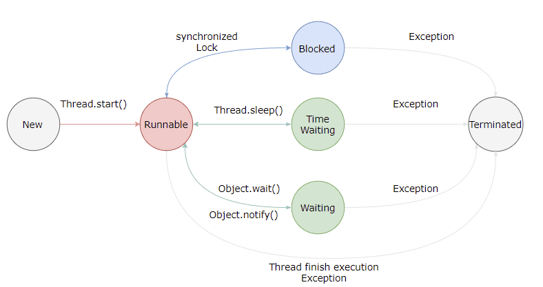

### 多线程的出现是为了解决什么问题？本质是什么？

CPU、内存、I/O设备的速度有极大差异

为了合理利用CPU的高性能，平衡三者速度差异

1. CPU增加了缓存，均衡和内存的速度差异  // 导致可见性问题
2. 操作系统增加了进程、线程，分时复用CPU，均衡CPU和I/O设备的速度差异 // 导致原子性问题
3. 编译程序优化指令执行次序，使得缓存能够更加合理利用 // 导致有序性问题

### Java如何解决并发问题

Java内存模型规范了JVM如何提供按需禁用缓存和编译优化的方法。

1. volatile, synchronized 和final关键字
2. Happens-before规则

* 原子性 操作不可被中断
* 可见性
  * volatile关键字保证可见性， 保证修改的值立即被更新到主存，其他线程读取直接取主存读取
  * synchronized和Lock也能保证可见性，保证同一时刻只有一个线程获取锁执行同步代码，释放锁时i刷到主存

* 有序性

  * JMM通过Happens-before规则保证有序性

### 线程安全有哪些实现思路

   1. 互斥同步(阻塞同步)

      synchronized和ReentrantLock

2. 非阻塞同步

   CAS, AtomicInteger

3. 无同步方案

   栈封闭， 线程本地存储

### 如何理解并发和并行的区别

并发指**一个处理器**同时处理多个任务

并行指**多个处理器或者多核的处理器**同时处理多个任务

### 线程有哪几种状态？分别说明从一种状态到另一种状态转变有哪些方式？

新建、可运行、阻塞、无限期等待、限期等待、死亡

### 通常线程有哪几种使用方式？

1. 实现Runnable接口
2. 实现Callable接口 前两种只能当作是一个可以在线程中运行的任务，最后还是需要通过Thread来调用
3. 继承Thread类

### 线程的互斥同步方法有哪些？如何比较和选择？

1. 锁的实现

   JVM实现的synchronized， JDK实现的ReentrantLock

2. 性能 

   synchronized优化(自旋锁)后大致相同

3. 等待可中断

   持有锁的线程长期不释放锁的时候，正在等待的线程可以选择放弃等待，去处理其他事情

   ReentrantLock可中断，synchronized不可

4. 公平锁

   指多个线程等待同一个锁时，按照申请锁的时间顺序来获得锁

   synchronized的锁是非公平的, ReentrantLock默认情况下非公平，可以是公平的

5. 锁绑定多个条件

   ReentrantLock可以绑定多个Condition对象

### 线程之间有哪些协作方式？

* join()

  在线程中调用另一个线程的join()方法，会将当前线程挂起，直到目标线程结束

* wait() notity() notifyAll()

  wait()线程等待某个条件满足，线程在等待时会被挂起，当其他线程的运行使得这个条件满足时，其他线程调用notify()或notifyAll()来唤醒被挂起的线程

  只能在同步方法或者同步控制块中使用，wait()挂起期间，线程会释放锁

* wait()和sleep()的区别

  wait()是Object的方法，sleep()是Thread的静态方法

  wait()会释放锁，sleep()不会

* await() signal() signalAll()

  java.util.concurrent类库中提供了Condition类来实现线程之间的协调, 可以在Condition上调用await()方法使线程等待。

  await()可以指定等待的条件，更加灵活

## 并发关键字

### synchronized 可以用在哪里

* 对象锁
* 方法锁
* 类锁

### synchronized方法本质上是通过什么保证线程安全的

* 加锁和释放锁

* 可重入的原理： 加锁次数计数器，在同一锁程内，线程不需要再次获取同一把锁

* 保证可见性的原理：内存模型和Happens-before规则

  监视器锁规则：对同一个监视器的解锁, Happens-before对该监视器的加锁

### Happens-Before

如果A Happens before B， 那么A 的执行结果对B可见

### 对象的实例化

Instance instance = new Instance();

1. 分配内存空间 Instance instance
2. 初始化对象 new Instance()
3. 将内存空间的地址赋值给对应的引用 = 

操作系统可能对指令重排序，多线程环境下可能将一个未初始化的对象引用暴露出来