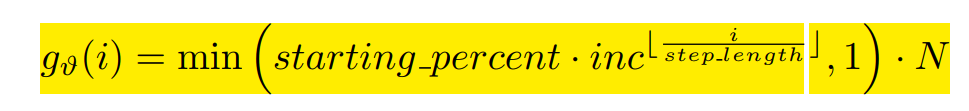

### 初步方法

在On The Power of Curriculum Learning in Training Deep Networks  一文中，可以看出课程学习应用于深度学习时，参与训练的样本数是递增的，直到增加到整个数据集。

Fixed expoential pacing.

而在联邦学习里，这样的设计可以修改为：

gv表征参与训练的候选集合的大小，而在候选集合中进行随机选取。（最朴素的修改方式），也就是说，当gv很小时，只有少数的几个客户端是候选客户端。

根据客户端的难度对客户端进行升序，得到一个“与难度正相关的权重”，进一步计算中选的概率，当gv大于M时，从候选集合中选取M个客户端，这样，难度较大的客户端被选中的概率就会高于难度较小的客户端，而难度较小的客户端因为在之前的训练轮次中已经多次参与训练，所以很大程度上提高了各个客户端的参与率。

### 该方法存在的问题及改进方法

客户端中存在的简单样本会很大程度上干扰后续的选择，如果说一个客户端上的简单样本很多的话，那么客户端难度会一直保持在一个很低的，那么这些客户端上的困难样本可能没有得到充分的训练，所以设计一个动态修改客户端难度的算法：

训练流程

