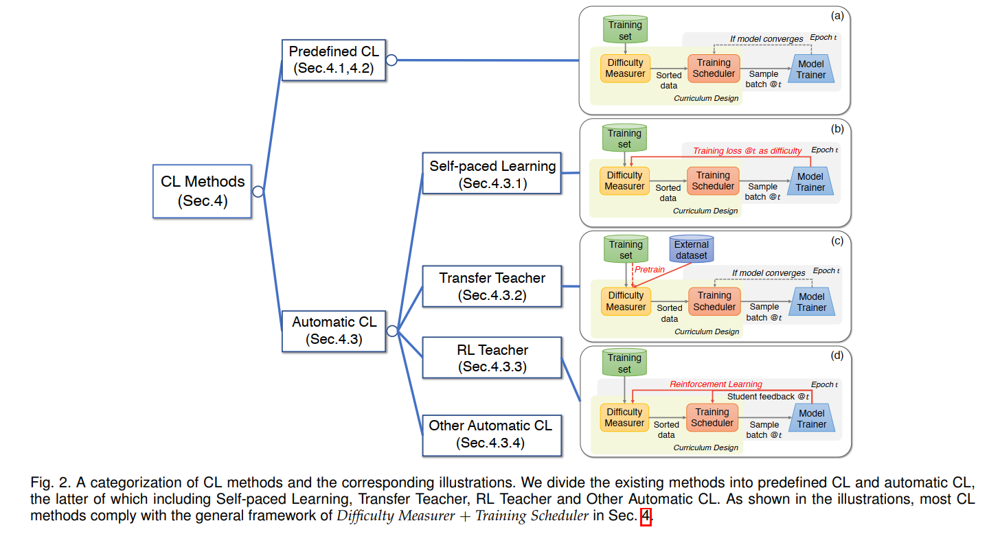
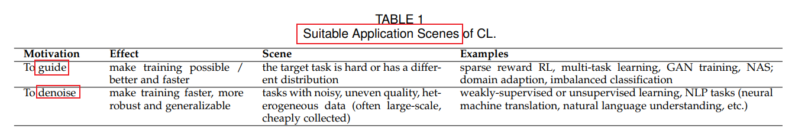
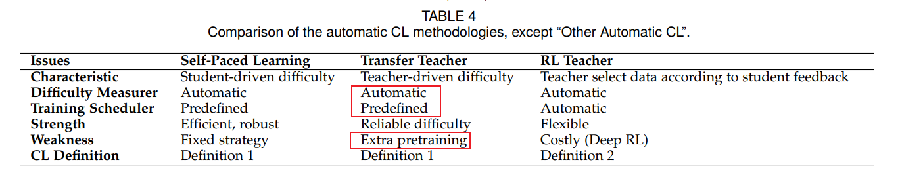
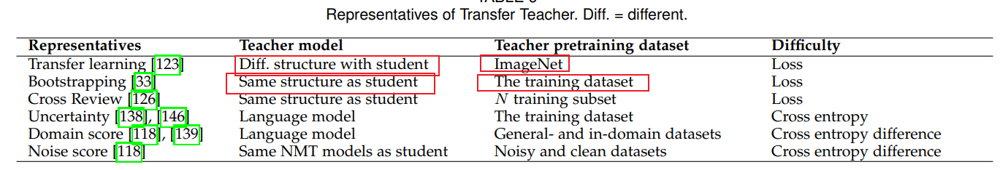

### 综述  a survey on  curriculum learning

### 1. When do curricula work in federated learning

第4节curricula on clients , 本文使用bootstrapping的方法作为difficulty measurer

### 2. FlexMatch: Boosting Semi-Supervised Learning with Curriculum Pseudo Labeling  

**Motivation:** FixMatch uses a pre-defined constant threshold for all classes

- modern SSL algorithms handle all classes equally without considering their different learning difficulties

**Method：** Curriculum Pseudo Lableing(CPL)

- leverage unlabeled data according to the model's learning status

动态调整无标签数据参与训练的情况

### 监督学习： transfer learning

### 半监督学习(SSL):  curriculum pseudo labeling